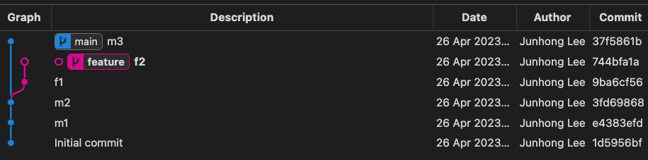
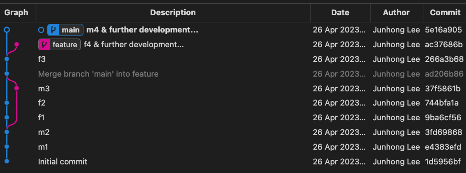

# Workflow with branch

One creates `feature` branch and then commits works. Now, one wants to merge `feature` branch back to the `main` branch, but someone already made commtis to `main` branch as:


How does one proceed? 

1. Merge `main` into `feature`
```shell
git checkout <feature>
git merge main
```

(2. work and commit in `feature` branch)

3. Merge `feature` into `main`
```shell
git checkout main
git merge <feature>
```

Finally, it looks like this:
